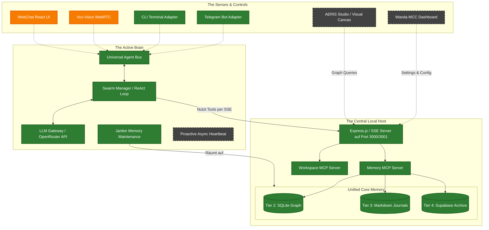

# WANDA Ecosystem Architecture

This diagram visualizes the structural components of the WANDA Gen-2 system. 

- **Grün (Done):** Abgeschlossen und getestet (Das Fundament: Memory, Host, Workspace).
- **Orange (Next Phase):** Der logisch nächste Schritt (Agent Engine / The Brain).
- **Grau gestrichelt (Future Phase):** Geplante Frontends und Kanäle (The Senses & Controls).

### Der nächste logische Schritt (Execution Phase 5)

Da wir nun das **komplette Backend-Fundament** (WANDA Hub, Memory MCP, Workspace MCP) fertig implementiert und getestet haben, ist das System bereit, Befehle auszuführen – aber es fehlt der Akteur, der *denkt*. Ein Hub ohne Client ist stumm.

Daher ist der nächste logische Schritt die **Agent Engine (Phase 5: LLM Gateway & Swarm Tool Loop)**.
Wir müssen:
1. **Das LLM Gateway (`packages/providers/llm-gateway`) bauen:** Eine verlässliche Schnittstelle zu OpenRouter (und Ollama als Fallback) implementieren, die mit sauberen Streaming-Responses umgehen kann.
2. **Den Swarm Manager / ReAct Loop (`packages/core/swarm-manager`) implementieren:** Die eigentliche Schleife ("Agens"), die User-Nachrichten via `AgentBus` empfängt, an das LLM schickt, erkennt, dass das LLM Tools (aus unserem neuen Hub) aufrufen will, diese Tools ausführt und das Ergebnis wieder an das LLM gibt.

Ohne diese Schicht können unsere Interfaces (Voice, Webchat, AERIS) nicht mit der AI kommunizieren!
